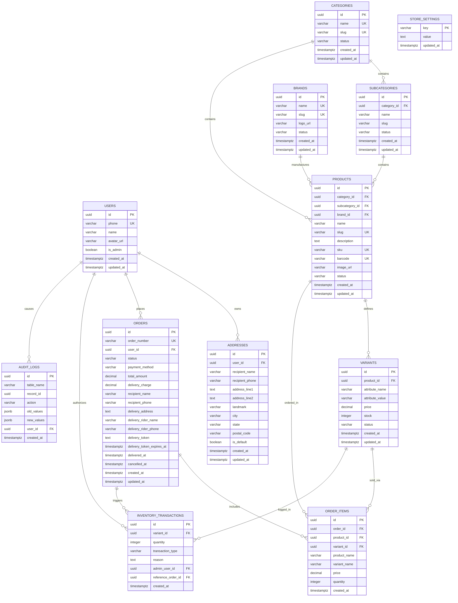

# ER_DIAGRAM.md

# Phase 3: Entity-Relationship Diagram - SHRI SIDDHIVINAYAK TRADING

This document illustrates the database entity relationships using Mermaid.js erDiagram notation.

```mermaid
erDiagram
    USERS {
        uuid id PK
        varchar phone UK
        varchar name
        varchar avatar_url
        boolean is_admin
        timestamptz created_at
        timestamptz updated_at
    }

    ADDRESSES {
        uuid id PK
        uuid user_id FK
        varchar recipient_name
        varchar recipient_phone
        text address_line1
        text address_line2
        varchar landmark
        varchar city
        varchar state
        varchar postal_code
        boolean is_default
        timestamptz created_at
        timestamptz updated_at
    }

    CATEGORIES {
        uuid id PK
        varchar name UK
        varchar slug UK
        varchar status
        timestamptz created_at
        timestamptz updated_at
    }

    SUBCATEGORIES {
        uuid id PK
        uuid category_id FK
        varchar name
        varchar slug
        varchar status
        timestamptz created_at
        timestamptz updated_at
    }

    BRANDS {
        uuid id PK
        varchar name UK
        varchar slug UK
        varchar logo_url
        varchar status
        timestamptz created_at
        timestamptz updated_at
    }

    PRODUCTS {
        uuid id PK
        uuid category_id FK
        uuid subcategory_id FK
        uuid brand_id FK
        varchar name
        varchar slug UK
        text description
        varchar sku UK
        varchar barcode UK
        varchar image_url
        varchar status
        timestamptz created_at
        timestamptz updated_at
    }

    VARIANTS {
        uuid id PK
        uuid product_id FK
        varchar attribute_name
        varchar attribute_value
        decimal price
        integer stock
        varchar status
        timestamptz created_at
        timestamptz updated_at
    }

    INVENTORY_TRANSACTIONS {
        uuid id PK
        uuid variant_id FK
        integer quantity
        varchar transaction_type
        text reason
        uuid admin_user_id FK
        uuid reference_order_id FK
        timestamptz created_at
    }

    ORDERS {
        uuid id PK
        varchar order_number UK
        uuid user_id FK
        varchar status
        varchar payment_method
        decimal total_amount
        decimal delivery_charge
        varchar recipient_name
        varchar recipient_phone
        text delivery_address
        varchar delivery_rider_name
        varchar delivery_rider_phone
        text delivery_token
        timestamptz delivery_token_expires_at
        timestamptz delivered_at
        timestamptz cancelled_at
        timestamptz created_at
        timestamptz updated_at
    }

    ORDER_ITEMS {
        uuid id PK
        uuid order_id FK
        uuid product_id FK
        uuid variant_id FK
        varchar product_name
        varchar variant_name
        decimal price
        integer quantity
        timestamptz created_at
    }

    STORE_SETTINGS {
        varchar key PK
        text value
        timestamptz updated_at
    }

    AUDIT_LOGS {
        uuid id PK
        varchar table_name
        uuid record_id
        varchar action
        jsonb old_values
        jsonb new_values
        uuid user_id FK
        timestamptz created_at
    }

    USERS ||--o{ ADDRESSES : "owns"
    USERS ||--o{ ORDERS : "places"
    USERS ||--o{ INVENTORY_TRANSACTIONS : "authorizes"
    USERS ||--o{ AUDIT_LOGS : "causes"
    
    CATEGORIES ||--o{ SUBCATEGORIES : "contains"
    CATEGORIES ||--o{ PRODUCTS : "contains"
    SUBCATEGORIES ||--o{ PRODUCTS : "contains"
    BRANDS ||--o{ PRODUCTS : "manufactures"
    
    PRODUCTS ||--o{ VARIANTS : "defines"
    PRODUCTS ||--o{ ORDER_ITEMS : "ordered_in"
    
    VARIANTS ||--o{ ORDER_ITEMS : "sold_via"
    VARIANTS ||--o{ INVENTORY_TRANSACTIONS : "logged_in"
    
    ORDERS ||--o{ ORDER_ITEMS : "includes"
    ORDERS ||--o{ INVENTORY_TRANSACTIONS : "triggers"
```
