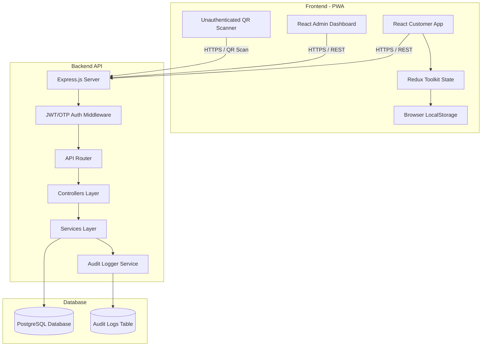
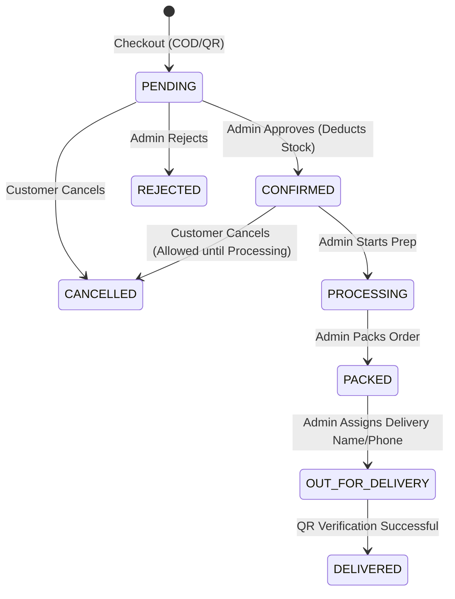

# SYSTEM_ARCHITECTURE.md

# Phase 2: System Architecture - SHRI SIDDHIVINAYAK TRADING

## 1. High-Level Architecture Diagram
The system follows a classical 3-Tier Architecture designed for scale, offline capability (PWA), and fast mobile rendering.



---

## 2. Frontend Architecture
The customer application is optimized for mobile screens, while the admin dashboard is optimized for responsive web screens (desktop, tablet, and mobile).

- **Build Tool:** Vite (for extremely fast compilation and hot module replacement).
- **Core Library:** React 18+ (utilizing Hooks and Functional Components).
- **State Management:** Redux Toolkit (`@reduxjs/toolkit` and `react-redux`).
  - **Slices:**
    - `authSlice`: Manages user credentials, JWT tokens, and user profile.
    - `cartSlice`: Handles adding/removing items, variant selections, item quantities, and localStorage synchronization.
    - `catalogSlice`: Caches products, categories, subcategories, and brands.
    - `orderSlice`: Tracks active and historical orders.
    - `storeSlice`: Holds store settings (opening hours, contact details, store open/closed status).
- **Styling:** Tailwind CSS for a premium utility-first UI, custom CSS variables in `index.css` for consistent HSL color schemes.
- **Routing:** React Router DOM (v6) with Private Routes (`AdminRoute`) and public checkout guards.
- **API Client:** Axios instance configured with request/response interceptors to automatically append JWT headers and handle session expiration (401 errors).
- **Progressive Web App (PWA):**
  - Web App Manifest (`manifest.json`) specifying icons, theme colors, and display modes.
  - Workbox Service Worker for offline asset caching and service worker lifecycle management.

---

## 3. Backend Architecture
The backend is a Node.js runtime environment running an Express.js server, structured around a clear separation of concerns.

- **Directory Structure:**
  ```
  backend/
  ├── config/             # DB Connection, Environment variables
  ├── middleware/         # Auth, Role checking, Validation, Error handler
  ├── controllers/        # Request handling and response formatting
  ├── services/           # Business logic and DB queries
  ├── routes/             # Express API Endpoints
  ├── utils/              # Cryptography, QR helpers, validation schemas
  └── server.js           # Server initialization
  ```
- **Layer Details:**
  1. **Routing Layer:** Maps HTTP endpoints directly to appropriate controller methods.
  2. **Middleware Layer:**
     - `auth.js`: Extracts JWT from headers, verifies signatures, and attaches the user payload to the request object (`req.user`).
     - `isAdmin.js`: Checks user records to ensure the user possesses the admin flag.
     - `validate.js`: Checks incoming request payloads against Joi schemas.
  3. **Controller Layer:** Sanitizes inputs, delegates to Service Layer, and returns HTTP responses.
  4. **Service Layer:** Executes database logic, manages PostgreSQL transactions, and triggers audit updates.

---

## 4. Authentication Architecture
The system utilizes a secure passwordless login using Mobile Numbers and One-Time Passwords (OTPs), backed by stateless JWT sessions.

```
[Customer Client]                 [Backend API]                    [Database]
       |                                |                              |
       |--- 1. Request OTP (Mobile) --->|                              |
       |                                |--- 2. Gen OTP (e.g. 123456) ->| (Temp Store/DB)
       |<-- 3. Success / Mock Sent -----|                              |
       |                                |                              |
       |--- 4. Verify OTP (Code) ------>|                              |
       |                                |--- 5. Validate OTP --------->|
       |                                |--- 6. Find or Create User -->|
       |<-- 7. Response (JWT Token) ----|                              |
```

- **JWT Token Strategy:**
  - Token signed with `JWT_SECRET` containing user ID, phone number, and admin status.
  - Token is stored in `localStorage` in the frontend (or cookie-based) and transmitted via the `Authorization: Bearer <token>` header.
  - Expiry is set to a long duration (e.g., 30 days) to match the convenience of a retail client mobile application.

---

## 5. Order Workflow Lifecycle
Orders proceed through a highly structured status flow. Inventory adjustments occur programmatically at critical steps.



- **Status Transition Constraints:**
  - **Deduction:** Stock is deducted when the order status changes to `CONFIRMED`.
  - **Restoration:** If a `CONFIRMED` or `PROCESSING` order is `CANCELLED`, inventory levels are automatically restored.
  - **Cancellation Window:** Customers can cancel orders *only* when the status is `PENDING` or `CONFIRMED`. Once the status advances to `PROCESSING`, cancellation is disabled.

---

## 6. Delivery & QR Verification Workflow
To verify physical delivery without creating accounts for delivery riders, the system leverages a signed, cryptographic verification token.

### 6.1 Cryptographic Token Structure
When an order's status is changed to `OUT_FOR_DELIVERY`, the system computes a secure verification token:
- **Payload:** `order_id`, `assigned_phone`, `created_at`, `expires_at` (set to 24 hours).
- **Signature:** A HMAC-SHA256 signature using `JWT_SECRET` to prevent tampering.

### 6.2 Step-by-Step Flow
1. **Assignment:** Admin assigns a delivery rider's Name and Phone Number to a packed order. The order transitions to `OUT_FOR_DELIVERY`.
2. **Generation:** The customer's mobile app polls or updates the order state. It detects `OUT_FOR_DELIVERY` and generates a QR code containing the URL:
   `https://siddhivinayak-trading.vercel.app/delivery/verify?token=<JWT_TOKEN>`
3. **Scanning:** The delivery person opens their phone camera and accesses the unauthenticated scanner page `/delivery/scan`.
4. **Submission:** The delivery person scans the customer's QR code. The browser redirects to `/delivery/verify?token=<JWT_TOKEN>` and fires a POST request to the API:
   `POST /api/orders/delivery/verify` with body `{ token }`.
5. **API Validation:**
   - Decodes and verifies the token signature.
   - Asserts `expires_at` has not passed.
   - Checks if the order is currently in `OUT_FOR_DELIVERY` status.
   - Transitions order state to `DELIVERED`.
   - Records the delivery timestamp.
6. **Result Display:** The verification screen displays a Success Checkmark (Green) indicating delivery is confirmed. If expired or invalid, it displays an Error (Red) screen.
